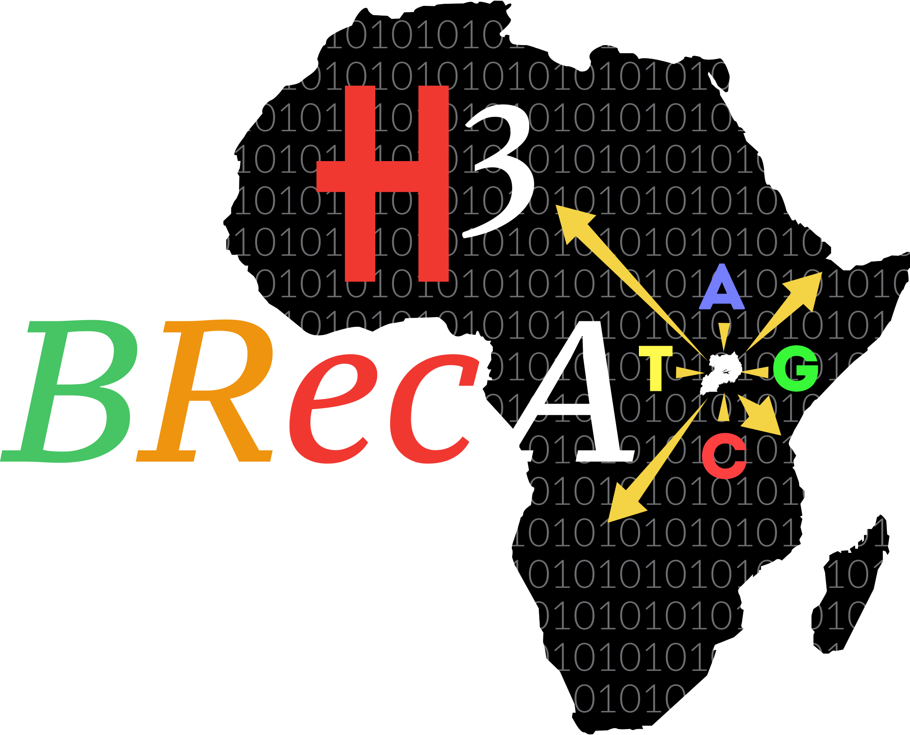

 

# Msc. Introduction To Python for Bioinformatics

Python is a modern, robust, high-level programming language. It is straightforward to pick up even if you are entirely new to programming. 

Python, similar to other languages like Matlab or R, is interpreted hence runs slowly compared to C++, Fortran or Java. However, writing programs in Python is very quick. Python has an extensive collection of libraries for everything from scientific computing to web services. It caters for object-oriented and functional programming with a module system that allows large and complex applications to be developed in Python. 

These lectures use Jupyter notebooks which mix Python code with documentation. The python notebooks can be run on a web server or stand-alone on a computer. They provide a simple but enriched understanding of the building blocks for this unique programming language.

 

